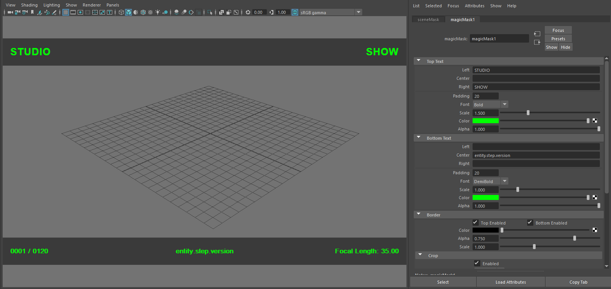
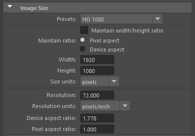
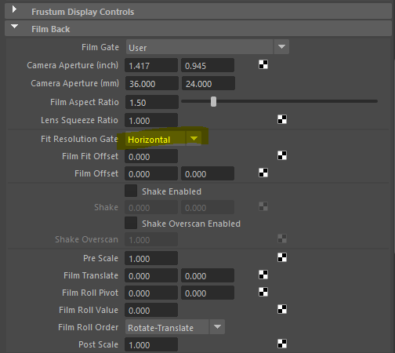
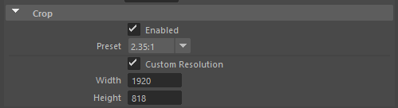
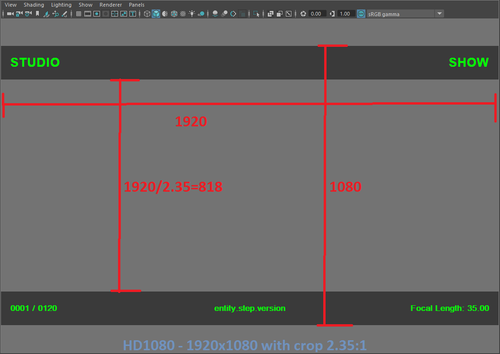

# maya-plugin-magic-mask
Maya hud plugin based on viewport 2.0




### INSTALLATION
1. Download the latest release and unzip the folder where you want to live.
2. Copy plugin file  "_magicMask.py_" into %USERPROFILE%/Documents/maya/plugins
3. Copy icon file  "_out_magicMask.png_" into %USERPROFILE%/Documents/maya/icons


### USAGE
```python
import maya.cmds as cmds
cmds.createNode("magicMask")
```

#### Render Setting
Before using this mask node, please do set the render settings



#### Camera Resolution Fit Setting
All fit type work well, but the "Horizontal" type will get a better view


#### Crop
* Use crop preset

* Use custom resolution


**HD1080 with crop 2.35:1**


#### Dynamic - Frame & Focal Length


### RELEASE
[RELEASE INFO](RELEASE.md)


### HAVING ISSUES?
Please send an email with the error message and a detailed step by step process of how you got the error.
Comments, suggestions and bug reports are welcome.  
